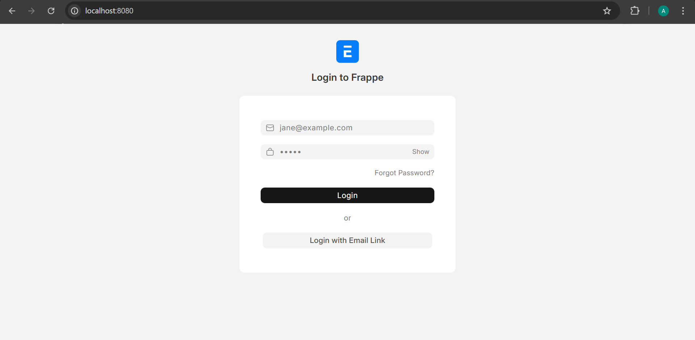

# 📚 Library Management System (Frappe App)

A full-stack **Library Management System** built using the **Frappe Framework** to efficiently manage books, members, and library transactions.

This project demonstrates practical implementation of **backend development, database design, and workflow automation** using Frappe.

---

## 🚀 Features

* 📖 Add, update, and manage books
* 👤 Manage library members
* 🔄 Issue and return books
* ⏳ Track due dates and availability
* 🧾 Maintain transaction records
* ⚙️ Admin-friendly interface

---

## 🛠️ Tech Stack

* **Framework:** Frappe
* **Backend:** Python
* **Database:** MariaDB
* **Environment:** Docker

---

## 📂 Project Structure

```
library_management/
├── library_management/
│   ├── doctype/
│   ├── config/
│   ├── hooks.py
│   └── modules.txt
├── screenshots/
├── README.md
└── setup files
```

---

## ⚙️ Setup Instructions

### Prerequisites

* Docker installed
* Frappe Bench environment

### Steps

1. Clone the repository:

```
git clone https://github.com/mayur-godbole/library-management.git
cd library-management
```

2. Start Frappe environment (Docker):

```
docker-compose -f pwd.yml up -d
```

3. Access container:

```
docker-compose -f pwd.yml exec backend bash
```

4. Install the app on your site:

```
bench --site library.localhost install-app library_management
```

5. Open in browser:

```
http://library.localhost:8080
```

---

## 📸 Application Screenshots

### 🔐 Login Page



### 📘 Book Form View


### 📚 Book List View


### 🧾 DocType List View


### 📝 DocType Form View


### 🔄 Issue Transaction


### 🔁 Return Transaction


### 👤 Member Record


### ⚠️ Validation Error


### ✅ Validation Working


---

## 💡 What I Built

### 📌 Custom DocTypes:

* Books
* Members
* Transactions

### ⚙️ Implementations:

* Book issuing and returning workflow
* Data management system using Frappe backend
* Structured application using Frappe best practices

---

## 🎯 Use Case

This system can be used by:

* Schools
* Colleges
* Small libraries

to manage their book inventory and member transactions efficiently.

---

## 🚀 Future Enhancements

* 📊 Dashboard with analytics
* 💰 Fine calculation for late returns
* 🔔 Email/SMS notifications
* 🔐 Role-based access control

---

## 👨‍💻 Author

**Mayur Godbole**
Recent B.E Graduate
Interested in Backend Development & ERP Systems

---

## ⭐ Contributing

Feel free to fork this repo and contribute improvements!

---

## 📜 License

This project is licensed under the MIT License.

